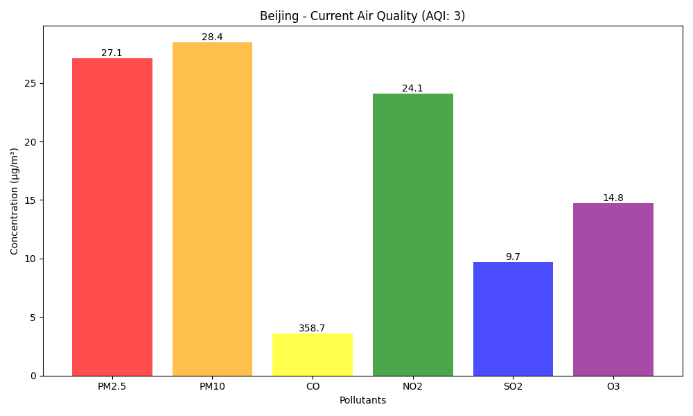

# AQI (Air Quality Index) Flask Server

AQI (Air Quality Index) Flask Server using the OpenWeatherMap AIr Pollution API. This server provides:

- **Real-time AQI Data**: Get current air quality index and pollutant concentrations
- **Historical Data Storage**: Automatically stores AQI data in SQLite database with 15-minute intervals
- **Forecast Data**: 4-day air quality forecasts
- **Pollutant Monitoring**: Tracks PM2.5, PM10, CO, NO2, SO2, O3, and more
- **Background Collection**: Automatic data collection for major cities

> [!WARNING]  
> If the OpenWeatherMap API is unavailable, the server **automatically generates and serves realistic synthetic data**.

## Installation

1. Clone the repository:
```bash
git clone <repository-url>
cd aqi-flask-server
```
2. Create a virtual environment:
```bash
python -m venv venv
source venv/bin/activate
```

3. Install dependencies:
```bash
pip install -r requirements.txt
```

4. Set up environment variables (create _.env_ file):
```bash
cd src
echo "OPENWEATHER_API_KEY=your_api_key_here" > .env
```

5. The API key is obtained from [OpenWeather)](https://openweathermap.org/api). [^1]

[^1]: It takes a few hours to get the free API key activated, feel free to contact me if you need assistance when setting it up `:)`.

## Usage

```bash
python app.py
```

The server will:
1. Initialize the SQLite database
2. Generate fake data as fallback
3. Start background data collection
4. Launch Flask server on `http://localhost:5000`


## API Endpoints
1. Current AQI Data
```bash
GET /api/current
```

Parameters:
- `lat` (float): Latitude
- `lon` (float): Longitude

Example:
```bash
curl "http://localhost:5000/api/current?lat=40.7128&lon=-74.0060"
```

2. Forecast AQI Data
```bash
GET /api/forecast
```

Parameters:
- `lat` (float): Latitude
- `lon` (float): Longitude

Example:
```bash
curl "http://localhost:5000/api/forecast?lat=51.5074&lon=-0.1278"
```

3. Historical AQI Data
```bash
GET /api/historical
```

Parameters:
- `lat` (float): Latitude
- `lon` (float): Longitude
- `start` (string): Start data (ISO format: YYYY-MM-DD)
- `end` (string): End data (ISO format: YYYY-MM-DD)

Example:
```bash
curl "http://localhost:5000/api/historical?lat=48.8566&lon=2.3522&start=2025-06-25&end=2025-07-02"
```

4. Health Check
```bash
GET /api/health
```

Example
```bash
curl "http://localhost:5000/api/health"
```

## Response format
All endpoints return JSON data with the following structure:

```json
{
  "coord": {
    "lat": 39.9042,
    "lon": 116.4074
  },
  "list": [
    {
      "components": {
        "co": 373.17,
        "nh3": 4.04,
        "no": 0.18,
        "no2": 20,
        "o3": 27.5,
        "pm10": 39.81,
        "pm2_5": 38.52,
        "so2": 9.4
      },
      "dt": 1751433111,
      "main": {
        "aqi": 3
      }
    }
  ]
}
```

## Testing
To run the tests:

```bash
python test_client.py
```

This will:
1. Test all API endpoints
2. Generate visualization plots:
- `current_beijing.png` - Real-time pollutant levels (PM2.5, PM10, CO, NO2, SO2, O3)
- `forecast_beijing.png` - 4 day AQI and PM2.5 projections
- `historical_beijing.png` - Previous 7-day AQI trends

## Generated data
__Current Pollutant Levels:__




__AQI Forecast:__


__Historical AQI Data:__

